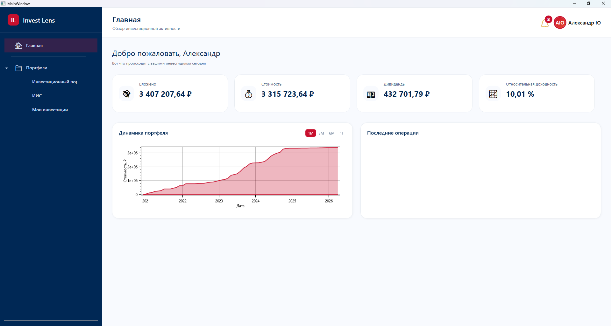
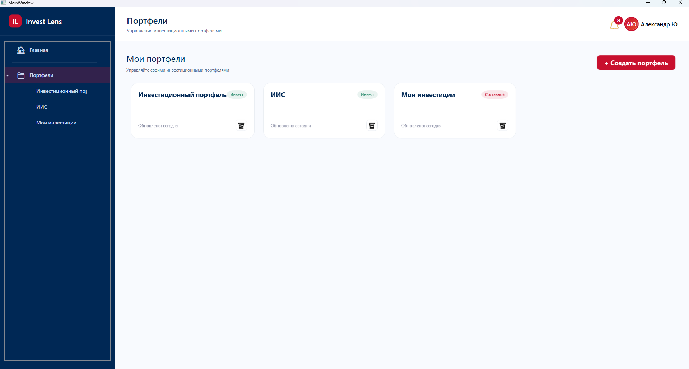
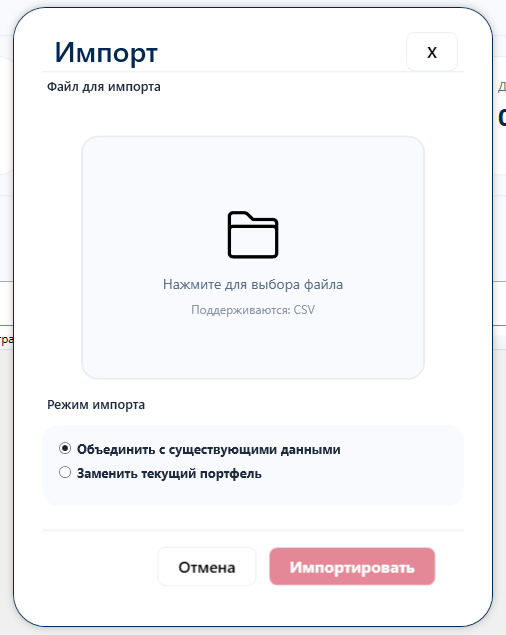
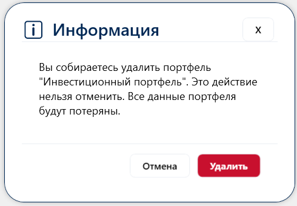

# Invest Lens

**Инвестиционный трекер для управления личными финансами и портфелями ценных бумаг**


---

## 📌 О проекте

**Invest Lens** — десктопное приложение для управления инвестиционными портфелями. Разработано для тех, кто хочет структурировать свои инвестиции, отслеживать доходность и анализировать динамику вложений.

Приложение позволяет создавать простые и составные портфели, импортировать данные о сделках, отслеживать ключевые метрики и визуализировать динамику на графиках.

### 🎯 Основные возможности

| Функция | Описание |
|---------|----------|
| 🔐 **Аутентификация** | Регистрация и вход с валидацией пользователей |
| 📁 **Управление портфелями** | Создание, редактирование и удаление простых/составных портфелей |
| 📥 **Импорт сделок** | Поддержка CSV-файлов с форматом Snowball Income |
| 📊 **Дашборд** | Ключевые метрики: вложенные средства, текущая стоимость, дивиденды, доходность |
| 📈 **Графики** | Визуализация динамики вложенных средств (OxyPlot) |
| ⏳ **UI-блокировка** | Busy-индикатор для длительных операций |
| ✅ **Валидация** | Проверка уникальности портфелей, существования пользователей, совпадения паролей |

---

## 🖥️ Технологический стек

| Компонент | Технология |
|-----------|------------|
| **UI** | WPF (net9.0-windows) |
| **Архитектура** | MVVM |
| **DI** | Autofac |
| **ORM** | Entity Framework Core |
| **База данных** | SQLite |
| **Графики** | OxyPlot |
| **Маппинг** | AutoMapper |

---

## 🚀 Начало работы

### Требования

- **.NET 9.0 SDK** (скачать: [dotnet.microsoft.com](https://dotnet.microsoft.com/download/dotnet/9.0))
- **Windows 10/11** (приложение использует WPF)
- **Visual Studio 2022** (с поддержкой .NET 9.0) / Rider / VS Code

### Установка

```bash
git clone https://github.com/Alexander-Yurtaev/InvestLens.WPF.git
cd InvestLens
dotnet restore
dotnet build
```

### Настройка базы данных

База данных SQLite создаётся и обновляется автоматически при первом запуске приложения через **Entity Framework Migrations**.

**Вам ничего не нужно делать вручную** — приложение само применит все необходимые миграции.

> **Если вы вносите изменения в модель данных:**

1. Добавьте новую миграцию:
   ```bash
   dotnet ef migrations add <НазваниеМиграции> --project src/InvestLens.DataAccess
   ```
2. При следующем запуске приложение автоматически накатит её

**Где искать файл `investlens.db`:**

| Режим запуска | Путь |
| --- | --- |
| Visual Studio (Debug) | `%LOCALAPPDATA%\InvestLens\DEBUG\` |
| Релиз / обычный запуск | `%LOCALAPPDATA%\InvestLens\` |

> **Удаление БД:** Если нужно полностью пересоздать базу (например, при отладке), удалите файл `investlens.db` в указанной папке. При следующем запуске приложение создаст новую БД через миграции.

### Запуск приложения

```bash
dotnet run --project src/InvestLens.App
```

---

## 📁 Структура проекта

```
InvestLens/
├── src/
│   ├── InvestLens.App/           # WPF приложение (Windows, UserControls, Styles)
│   ├── InvestLens.ViewModels/    # ViewModel'ы (MVVM логика)
│   ├── InvestLens.Model/         # Доменные модели и CRUD модели
│   ├── InvestLens.DataAccess/    # Repository, DbContext, миграции
│   └── InvestLens.Common/        # Утилиты, Helpers, Converters
└── tests/
    └── InvestLens.Tests/         # Unit тесты
```

---

## 🧩 Ключевые реализации

### 📦 Портфели

- **Простой портфель** — напрямую содержит транзакции
- **Составной портфель** — объединяет несколько простых портфелей

### 📥 Импорт данных

- Формат: CSV (совместим с экспортом Snowball Income)
- Режимы: **Merge** (объединение) / **Recreate** (замена)
- Валидация данных перед импортом

### 📊 Дашборд

- График динамики вложенных средств (OxyPlot)
- Карточки с ключевыми метриками
- Последние операции

### ⏳ Busy-индикатор

Переиспользуемый компонент для блокировки UI во время длительных операций:
- Анимированный спиннер
- Кастомизируемое сообщение
- Асинхронное отображение с await

---

## 🖼️ Скриншоты

| Главный экран | Управление портфелями |
|---------------|----------------------|
| ** | ** |

| Импорт сделок | Подтверждение удаления |
|---------------|----------------------|
| ** | ** |

---

## 🔮 Планы развития

- [ ] Интеграция с API для получения актуальных цен (MOEX)
- [ ] Расчет реальной текущей стоимости портфеля
- [ ] Экспорт отчетов (PDF, Excel)
- [ ] Темы оформления (светлая/темная)
- [ ] Плагины для дополнительных источников данных
- [ ] Уведомления о дивидендах

---

## 🤝 Контрибьюция

Поскольку проект разрабатывается в личных целях, контрибьюции не принимаются. Но вы можете форкнуть репозиторий для своих нужд.

---

## 📄 Лицензия

MIT License.

---

## 📬 Контакты

Автор: **Александр Юртаев**  
GitHub: [@Alexander-Yurtaev](https://github.com/Alexander-Yurtaev)  
Email: ayurtaev@mail.ru

---

> ⚡ *Invest Lens — взгляните на свои инвестиции иначе.*